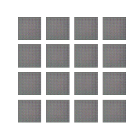
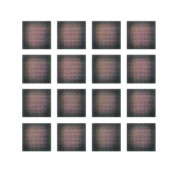
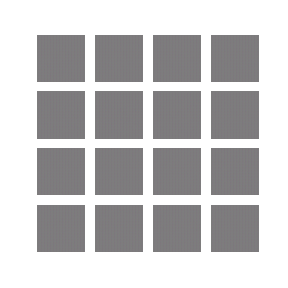

# PokéGAN
With every new generation of Pokémon, a whole slew of new species are introduced to the game, amounting to over 800 Pokémon species to-date!
Wouldn't it be cool if we could use these Pokémon and train a model to generate new Pokémon for us?

    

## Generative Adversarial Networks
PokéGAN is a GAN (Generative Adversarial Network) trained on images obtained from [this repo](https://github.com/PokeAPI/sprites). It involves 2 competing neural networks, a generator and a discriminator.

The generator takes in as input a random variable drawn from a simple distribution (a Gaussian distribution, in our case) and is trained to output a sample from a given target distribution (i.e. Pokémon sprites). The discriminator functions as a classifier. Given _real_ images from our dataset or _fake_ images generated by the generator, the discriminator's task is to classify them correctly as _real_ or _fake_.

The two models engage in a game where the generator tries to fool the discriminator while the discriminator has to correctly differentiate real from fake images. This minimax game pushes the generator to generate images that resemble those drawn from the target distribution (i.e. generate new Pokémon!).

## Model Architecture
My first iteration is based off of Tensorflow's [tutorial](https://www.tensorflow.org/tutorials/generative/dcgan). I incorporated some [GAN tricks](https://github.com/soumith/ganhacks) listed such as:
- Normalizing images to [-1, 1]
- Use tanh as the last layer of the generator (outputs in the range [-1, 1])
- Sample from Gaussian distrubution rather than Uniform
- Separate batches of real and fake images
- Use Leaky ReLU in both generator and discriminator
- Label smoothing: instead of hard labels (1 = real, 0 = fake), use random numbers between [0.7, 1.0] for real images and [0.0, 0.3] for fake images
- Noisy labels: Occasionally flip labels for discriminator (i.e. with 5% probability)
- Use ADAM optimizer
- Use Dropouts (i.e. 50% in generators)

This model worked really well on 28x28 images. Here's a gif of the generated images produced during training:

  

However, the sprites produced are quite small and the details are not too clear. This was because the images in the dataset consisted of white space around the sprites. I preprocessed the images using [Wand](http://docs.wand-py.org/en/0.5.9/) to remove the whitespace while maintaining 128x128 dimensions. This provides a more consistent view of the sprites. The generated images now look like this:

  

However, we see [mode collapse](https://developers.google.com/machine-learning/gan/problems#mode-collapse) occurring. So, I looked to newer models, such as Progressive GAN and StyleGAN, to generate higher quality images. I settled for Progressive GAN first because it was simpler and was what StyleGAN was based off of. Currently, I'm experimenting with 3 layers: 32x32 &rarr; 68x68 &rarr; 128x128. Here's a preview of what it looks like:

  

